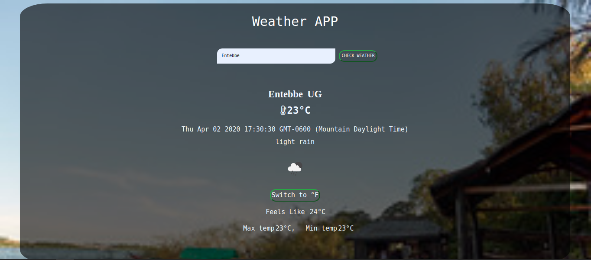

# weather-app [Microverse](https://www.microverse.org/)

The main purpose of this project is to create a weather app where users type in their cities, states and countries and the weather information of the location is returned to them. This is part of the [Ordin projects](https://www.theodinproject.com/courses/javascript/lessons/weather-app) from the [microverse](https://www.microverse.org/)  Javascript curriculum.

## Features
- A user enters a city
- Data in form of the weather, current temperature is returned to the user
- A user can change the metrics of the weather returned from Celcius to Fahrenheit and Fahrenheit to Celsius..
- An image of the city that the user checked for is returned in the background

## Live link
[Weather App](https://rawcdn.githack.com/ampaire/weather-app/7a6d585b71809de16913bcff25cbf0c53a53fcc7/dist/index.html)

## Built with
- Html and Css
- Javascript
- [Open Weather Api](https://openweathermap.org/api) for returning the weather information of the different cities
- [Flickr](https://www.flickr.com/services/api/) for displaying the background pictures of different cities

## Prerequisites
To comfortably use this project, prior knowledge of the following is ideal
- Html and Css
- Javascript
- Eslint
- Bootstrap 4
- Webpack
- Local storage

### Setup
Run 
~~~ 
$git clone https://github.com/ampaire/weather-app.git 
~~~
to clone this project to your local machine and then we get started.

Next run
~~~
$npm install
~~~
to install all the libraries that were used for this project.

You can then run the project in the live server if you have it installed in your code editor or by simply running the index.html page in the browser.

## Engineers
👤 **Phemia**

- Github: [@ampaire](https://github.com/ampaire)
- Twitter: [@AmpaPhem](https://twitter.com/AmpaPhem)
- Linkedin: [linkedin](https://linkedin.com/ampaire-phemia)

## 🤝 Contributing

Contributions, issues and feature requests are welcome!

Feel free to check the [issues page](https://github.com/ampaire/weather-app/issues).

## Show your support

Give a ⭐️ if you like this project!

## Acknowledgments
- [Ordin Lessons](https://www.theodinproject.com/courses/javascript/lessons/weather-app)